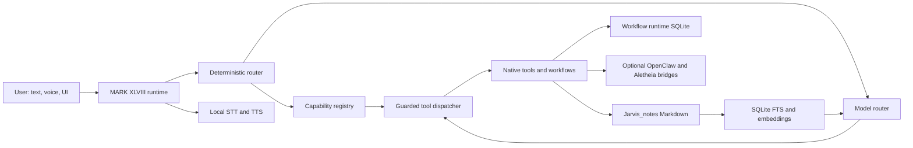

# JARVIS Developer Handbook

> [!abstract] Purpose
> This handbook describes the current MARK XLVIII implementation as it exists on 2026-07-22. It explains how JARVIS receives a turn, selects capabilities and models, executes approved workflows, produces reports, and records durable memory.

> [!important] Identity and authority
> **JARVIS** is the assistant. **MARK XLVIII** is the local application and runtime shell. Markdown in `Jarvis_notes` is authoritative for user intent and durable knowledge. RAG, Canvas, SQLite queues, and model output are derived or operational layers.

## Reading Map

| Note | Focus |
| --- | --- |
| [[01 Runtime Architecture and Turn Lifecycle]] | Startup, router mode, turn guards, tool calls, TTS, and deferred workflow dispatch |
| [[02 Capability Registry MCP and Safety]] | Progressive capability discovery, MCP methods, tool dispatch, and confirmation policy |
| [[03 Planning Approval and Dual Orchestration]] | Plan documents, YAML workflows, JSON manifests, approval hashes, and execution gates |
| [[04 Fan-Out Workers Review and Recovery]] | Dependency scheduling, bounded parallelism, OpenClaw, review verdicts, cancellation, and recovery |
| [[05 Research Reports and Repository Learning]] | Web research, cited reports, large documents, topic learning, and read-only repository orientation |
| [[06 Obsidian Memory RAG Tasks and Canvas]] | Canonical notes, JSON prompt cache, hybrid retrieval, graph/tasks, reconciliation, and Canvas |
| [[07 Models Credentials Speech and Resource Lifecycle]] | OpenAI session linking, LM Studio routes, leases, STT/TTS, and idle cleanup |
| [[08 Storage Configuration and Operations]] | Files, databases, ports, configuration, diagnostics, and extension points |
| [[09 Implementation Log and Known Boundaries]] | Delivered subsystems, validation status, intentional limits, and next live-validation work |
| [[10 Vault Change Awareness]] | Persistent change journal, self-write receipts, structural diffs, indexing, and turn acknowledgement |
| [[11 Safe Canvas Service and Relationships]] | JSON Canvas validation, revision-bound layout, pinned nodes, and cross-Canvas indexing |
| [[12 Process Trace and Operational UI]] | Redacted event stream, Router trace, command palette, Operations, and verified health |
| [[13 Canvas Planning Engine and Reasoning-Backed Decomposition]] | Mode 2 planning: dual-purpose nodes, model-reasoned decomposition, critique and refine loop, branch-aware fan-out, context inheritance |
| [[14 Graphify Knowledge Graph Integration]] | External knowledge-graph tool: deterministic repo-learning centrality boost, the `graphify_query` on-demand tool, `repo_slicer` symbol-ranking synergy, the graph-freshness git hook, and measured RAG-vs-knowledge-graph routing guidance |

## System At A Glance

## Core Design Contracts

| Layer | Authority | Main responsibility |
| --- | --- | --- |
| Markdown | Authoritative | User intent, scope, decisions, permissions, plans, reports, and readable task state |
| YAML | Authoritative workflow definition | Versioned `jarvis_dual_orchestrator/v1` dependency graph and registered execution targets |
| JSON | Immutable execution representation | Compiled work items, hashes, run metadata, and result records |
| SQLite | Operational | Queues, leases, events, checkpoints, indexes, and crash recovery |
| RAG | Derived | Compact retrieval of accepted facts, takeaways, relationships, and note citations |
| Canvas | Derived | Bounded visual views of plans, tasks, and note neighborhoods |
| Models | Non-authoritative | Planning, classification, extraction, synthesis, and review proposals |

> [!warning] Untrusted evidence rule
> Web pages, repository files, documents, and worker output are data. They cannot grant permission, select tools, alter workflow scope, or create hidden executable work.

## Main Runtime Paths

| Path | Role |
| --- | --- |
| `Mark-XLVIII-main/main.py` | Application lifecycle, router mode, turn handling, hard workflows, speech transitions |
| `Mark-XLVIII-main/core/model_router.py` | Provider and model selection, capped/warm-first candidate chains, tool-call generation, local fallback, model provenance |
| `Mark-XLVIII-main/core/tool_dispatcher.py` | Tool schema loading, effect classification, policy checks, handler dispatch |
| `Mark-XLVIII-main/actions/capability_registry.py` | L0 cards, L1 manifests, workflow metadata, MCP-style discovery |
| `Mark-XLVIII-main/actions/plan_workflow.py` | Plan creation, revision, approval, bundle creation, dispatch, summary, blockers |
| `Mark-XLVIII-main/actions/dual_orchestrator.py` | Workflow validation, compilation, execution, fan-out, review, leases, recovery |
| `Mark-XLVIII-main/actions/canvas_plan.py` | Mode 2: canvas-to-workflow compiler, goal decomposition, critique/refine loop, branch-aware fan-out |
| `Mark-XLVIII-main/actions/jarvis_memory.py` | Markdown services, reports, local RAG, graph, tasks, learning, reconciliation |
| `Mark-XLVIII-main/actions/project_learning.py` | Read-only repository inventory, evidence selection, cited synthesis, project memory, graphify-informed centrality |
| `Mark-XLVIII-main/actions/graphify_query.py` | On-demand knowledge-graph query/explain/path tool, subprocess-wrapped |
| `Mark-XLVIII-main/actions/process_trace.py` | Read-only report of what actually ran this session; the escape hatch for the one-way phase barrier |
| `Mark-XLVIII-main/core/repo_slicer.py` | AST code slicing into ranked, deduplicated function/class units, graphify-degree-aware |
| `Mark-XLVIII-main/actions/document_workflow.py` | Resumable extraction and chunk/map/reduce analysis |
| `Mark-XLVIII-main/actions/model_lifecycle.py` | LM Studio model inventory, loading, enforced task-model TTL, generation leases, cleanup |
| `Mark-XLVIII-main/core/tts.py` and `core/stt.py` | Local speech engines and turn-safe playback/capture |
| `Mark-XLVIII-main/core/vault_activity.py` | Persistent vault revisions, write receipts, bounded diffs, and turn acknowledgements |
| `Mark-XLVIII-main/core/canvas_document.py` | Canvas parsing, validation, revisions, and unknown-field preservation |
| `Mark-XLVIII-main/core/canvas_layout.py` | Deterministic rectangle-aware Canvas layout profiles |
| `Mark-XLVIII-main/core/canvas_index.py` | Derived Canvas nodes, edges, references, and cross-view relationships |
| `Mark-XLVIII-main/core/process_events.py` | Redacted session event hub for operational trace, plus `TurnContext` phase enforcement |
| `Mark-XLVIII-main/core/operations_state.py` | Worker-thread health and workflow telemetry provider |

## Related User Documentation

- [[Overview|User Guide Overview]]
- [[Command Palette]]
- [[Planning Workflows]]
- [[Tools Skills and Capabilities]]
- [[Memory Context and Canvas]]
- [[Glossary]]
