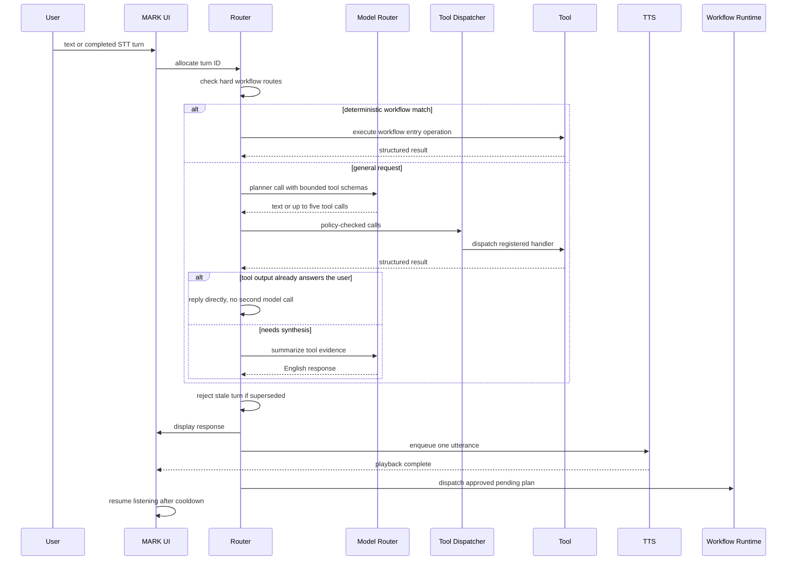

# Runtime Architecture and Turn Lifecycle

> [!abstract] Runtime model
> MARK XLVIII is a desktop Python application. Router mode is the only path: local STT/TTS, and model/tool requests through one guarded router.

## Startup Sequence

1. The single-instance guard prevents a second desktop process from owning the UI and runtime resources.
2. `JarvisLive` loads non-secret runtime configuration and initializes UI callbacks, state locks, turn counters, queues, and workflow identifiers.
3. The dashboard is started when its optional dependencies are available.
4. Router mode warms the local TTS service asynchronously, places the UI in `LISTENING`, and starts the local microphone loop.
5. Background loops perform model cleanup and, only when explicitly enabled, scheduled task reviews.

> [!success] There is exactly one runtime path
> `run()` starts router mode and nothing else. Gemini Live was **deleted** on 2026-07-30 — not deprecated — along with 758 lines of code that could never execute.
>
> It had been hardcoded off (`return bool(wants_gemini and False)`) for the whole local-first era, which meant **every branch guarded by `if self.session:` was unreachable**. Screenshot understanding lived entirely inside one: it captured the screen, announced that the image would arrive next turn, and answered from nothing. Two smaller costs surfaced during removal — every dashboard command polled 8 seconds for a session that could never appear, and `_execute_tool` returned a `google.genai` type, so a machine without that SDK would have crashed on every tool call.
>
> `test_no_gemini_live_session_path_remains` now fails the suite if `self.session`, `genai.Client`, `live.connect`, or `send_client_content` reappears in `main.py`.

> [!success] The two features that went inert with Live were resolved on 2026-07-30
> Both were started only as Gemini Live background tasks. They were decided separately rather than as one change.
>
> **`SystemMonitor` is wired to router mode, and makes no model call.** `check()` returned a prompt (`[SYSTEM_ALERT] ... Warn the user in their language`) because a model was going to phrase it; it now returns the sentence the user hears, and `_run_system_monitor` speaks it directly. Paraphrasing a number the machine already has would cost a model load, add latency, risk the number coming back wrong, and evict whatever is warm. It stays quiet while muted, speaking, or busy — an alert is never urgent enough to talk over an answer the user asked for — and `SystemMonitor` keeps a 300-second per-metric cooldown so a sustained condition warns once.
>
> **`ProactiveEngine` was retired, not rewired.** It handed the time plus stored memory to a model after 15 minutes of silence and let it decide whether to speak unprompted; on a one-task-model host that evicts the warm model to start a conversation nobody asked for. `actions/proactive.py` is deleted and recoverable from git history.

## One Conversational Turn

## Turn Phases (2026-07-29)

A turn moves through three phases, and the hand-off between them is deliberately one-way:

| Phase | Name | What happens |
| --- | --- | --- |
| 1 | `processing_request` | Working out what the user is asking for |
| 2 | `completing_operation` | Running tools to get it |
| 3 | `communicating_to_user` | Answering the user |

`core/process_events.TurnContext` carries the phase. It is created as a **local** in `_handle_router_text_command` and passed down — never stored on `JarvisLive` — so turns remain stateless with respect to each other. This is scope, not memory. `TurnContext.advance()` records the phase on the emitted event and refuses a non-monotonic transition.

> [!important] Only the phase is validated
> `category` and `state` stay free-form strings everywhere else. The process-trace panel builds its filter list from *observed* categories, so closing that vocabulary would buy nothing and force widget changes. Validate the thing that has an invariant; leave the log alone.

### The one-way barrier

Phase 3 answers the user's question; it does not narrate phase 2. Before this existed, `_build_tool_summary_prompt` carried roughly thirteen lines about tool mechanics, gates, and receipts against a single line about answering — so the model wrote about JARVIS's execution rather than about what was asked. The prompt now leads with answering and ends by saying explicitly not to describe which tools ran unless the user asked.

Two things are deliberately *kept* on that path:

- `evidence_block`'s nonce fence and untrusted-data framing. These are prompt-injection controls, not verbosity.
- One line naming the tools that actually ran. That is trusted grounding stated **outside** the fence, so the model never has to infer what executed from attacker-influenceable evidence. It was briefly removed as "mechanics" during development and three tests correctly caught it — the barrier governs what reaches the *user*, not what facts the model receives.

### Direct answers (skipping the phase-3 model call)

When a single tool whose output is already user-facing prose succeeds cleanly, the reply is that output — no second model call. On a host holding one task model at a time this often removes an evict-and-load cycle too.

All guards must hold: exactly one tool ran; its receipt is clean; the tool is in the `_DIRECT_ANSWER_TOOLS` whitelist (`weather_report`, `system_status`, `capability_registry`, `graphify_query`, `process_trace`); the result is short, plain, non-JSON text; and no confirmation gate fired.

> [!warning] Whitelisted by tool name, never by inspecting the result
> Letting content decide how it is presented is precisely how tool output would steer its own handling. One exception exists and is narrow: a near-empty or explicitly negative result (`No node matching ... found`) falls through to the model. That check reads content only to decide whether to *add* a model step. Live assessment caught the original of this — a misrouted question returned a tool's "not found" as the entire user-facing answer.

The unverified-completion notice runs on every path producing model prose, but **not** on the direct-answer path, where the text is the tool's own output and a genuine test-runner result would trip a false positive.

## Hard Workflow Routing

Before asking a model to choose a tool, `main.py` recognizes high-value request shapes that need deterministic ordering:

| Prompt family | Handler behavior |
| --- | --- |
| `create plan` | Runs plan research and writes a reviewable plan and run bundle |
| `revise plan` | Updates the latest or named plan and invalidates stale approval |
| `start plan` | Validates and approves the plan, queues execution after speech |
| `cancel planning` | Exits planning mode or requests cancellation for active work |
| `learn about this project` | Invokes read-only repository learning |
| `learn about <topic>` | Performs sourced topic learning and RAG persistence |
| blank to-do template | Creates the canonical Markdown template directly |
| current news plus report | Searches first, validates citations, then creates the report |
| capability question | Answers from the manifest with **zero model calls** |
| structural code question | Returns `graphify_query` alone |

This layer prevents a small local model from replacing a multi-step operation with a plausible paragraph.

The last two were added 2026-07-29 after live testing:

- **Capability questions** (`what tools do you have`) are answerable from a deterministic manifest that imports no model router at all, yet used to cost two model calls — planner tool-selection plus worker summarisation. `_handle_capability_overview_workflow` now answers directly. The detector deliberately refuses to fire when the prompt names an external artifact (pdf, file, document, paper), because a question *about a document* that reached the capability manifest is exactly how "extract the methods from this pdf" came back describing JARVIS's own backend.
- **Structural code questions** (`what calls X`, `what depends on Y`) require both an asking form and a code-shaped subject — a snake_case identifier, a `.py` file, or a call form. Requiring both halves keeps ordinary English such as "who uses this feature the most" out of it. Without this, a filename like `project_learning.py` tripped the `project` keyword, `project_operator` was offered alongside `graphify_query`, and the model chose the wrong one and invented a project id from the filename.

## General Tool Routing

For requests outside the hard routes:

1. The router builds a compact system prompt naming JARVIS, the current date/time, English-only behavior, and evidence boundaries.
2. Only schemas relevant to the prompt are supplied to `call_with_tools`.
3. A planner model may return prose or structured tool calls.
4. At most five returned calls are executed for the turn.
5. Tool results are truncated to a bounded summary payload and sent to a worker model for the final conversational answer — unless the direct-answer conditions above are met.
6. Project-learning answers may use only returned takeaways and cited report content. A degraded inventory cannot be converted into an invented architecture summary.

### Keyword matching and its collision class

Routing keywords are matched by `_rule_token_matches`. Multi-word phrases (`deep research`) match as substrings — they are specific enough. **Bare single words match on a leading word boundary**, because plain substring matching produced a recurring family of bugs:

| Keyword | Wrongly matched inside | Effect |
| --- | --- | --- |
| `repo` | `weather_report` | A weather request routed to project tooling |
| `ram` | `program`, `diagram`, `framework` | Unrelated prompts routed to system status |
| `read` | `already`, `thread` | Unrelated prompts routed to file tooling |

A simple trailing plural is still allowed (`projects` matches `project`). Only the *leading* boundary does the collision work, and an earlier strict-both-sides version silently stopped `projects`, `files`, and `tools` from matching anything for two releases before it was noticed.

> [!important] The model is never handed an empty tool list
> When no rule matches, the router falls back to a small read-only default set rather than `tools=[]`. With no tools the model cannot act at all, so it answers from the system prompt — and that is what produced a confident, entirely wrong answer about an uploaded PDF.

## Uploaded Files Across Turns (2026-07-29)

The UI drop zone announces an upload as a one-off synthetic turn carrying the path (`[FILE_UPLOADED] path=... | name=...`). Because router turns are stateless — `call_with_tools` takes a single string with no history — the *next* turn, the one that actually asks something about the file, had no idea a file existed. The path lived only on a Qt widget and was backfilled deep inside `_execute_tool`, far too late to help.

Three changes make the feature work end to end:

1. `_record_upload_announcement` remembers the active upload for the session. `_upload_context_note` then tells the model a file is in scope on subsequent turns — **path and name only, never contents**, so it cannot become an injection surface.
2. `_with_upload_path` resolves a missing `file_path` for file tools **before** `classify_effect` runs. Previously the confirmation gate classified first, so a prompt asked the user to approve an action on `file_path=''` — a file the message could not even name.
3. The routing table gained the document vocabulary it was missing (`method`, `methods`, `extract`, `section`, `paper`, `attached`), and an active upload biases a bare "summarise this" toward `file_processor`.

> [!warning] Classification must match behaviour
> `file_processor` was classified read-only while silently writing sibling files: analysis saved whenever a result exceeded ~600 characters, and extraction *always* wrote a `<name>_text.txt` next to the user's source. Saving is now opt-in (`save=true`); extraction returns bounded text instead. An omitted `action` is also treated as its real default (summarize) rather than falling to the generic write branch, which used to demand confirmation just to read a file the user had handed over.

> [!danger] Instruction loss was a fabrication vector
> In `_process_text_doc`, an unrecognised action set `instruction = action` *after* reassigning `action` to `"custom"`, against a `prompt_map` already built from the original (usually empty) instruction. The model therefore received raw file content with **no instruction at all** and free-associated. This is the most likely cause of the fabricated document summary recorded in the 2026-07-25 validation pass.

## Turn IDs and Stale Reply Suppression

Every router submission receives a generation-aware turn ID. A new typed command, accepted voice turn, mute transition, or interruption can invalidate older work. Before display and speech, the response checks whether its turn is still current.

> [!important] Why this exists
> Local models and TTS can finish late. Without a turn ID, an older answer can arrive after a newer user request, speak over it, or dispatch an obsolete plan.

Stale turns are logged as suppressed and do not enter TTS. Interruption also drains queued audio and cancels pending or active plan runs where possible.

## Voice Turn Formation

The local Vosk path accumulates partial transcripts and audio activity until a turn boundary is reached. Current defaults include:

- English STT: `en-us`.
- End-of-turn silence: 2.5 seconds.
- Idle recognizer restart: 18 seconds.
- Post-TTS microphone cooldown: 3 seconds.
- Quiet-audio warning threshold: RMS 300.
- Filler check-in eligibility: 15 minutes since the last user input.

Noise-only transcripts such as isolated filler are filtered or cooldown-limited. Muting resets STT state; unmuting starts a fresh capture generation.

## Speech and Workflow Handoff

`start_plan` does not immediately run workers inside the conversational response. It stores the run ID as pending, tells the user that execution is queued, and calls TTS. Only after the response has been handed to speech does `_dispatch_pending_plan_after_turn` start a daemon workflow thread.

> [!important] Conversation isolation
> Worker progress is written to workflow state and artifacts. It is not injected continuously into the active conversation. The UI receives a completion, blocker, decision, or explicit status result.

## Background Responsibilities

| Loop | Behavior |
| --- | --- |
| Model cleanup | Every configured idle interval, unload non-baseline LM Studio models if no protected activity is active |
| Task review | Checks once per minute but performs scheduled review only when the user explicitly enabled a cadence |
| Vault watcher | Debounces Markdown changes and refreshes the local index |
| Dashboard relay | Routes dashboard text into Live mode or the same router-mode turn handler |

## Failure Behavior

- Tool or planner failure falls back to a worker text call when that fallback is safe.
- Empty model output becomes an explicit `model returned no text` message rather than a fabricated answer.
- Stale results are discarded.
- Failed TTS uses Windows SAPI while Orpheus warms or recovers.
- Failed plans produce blocker notes instead of reporting false completion.
- Unknown external side effects use `UNKNOWN_OUTCOME`; they are not silently retried.

## Related Notes

- [[02 Capability Registry MCP and Safety]]
- [[03 Planning Approval and Dual Orchestration]]
- [[07 Models Credentials Speech and Resource Lifecycle]]
