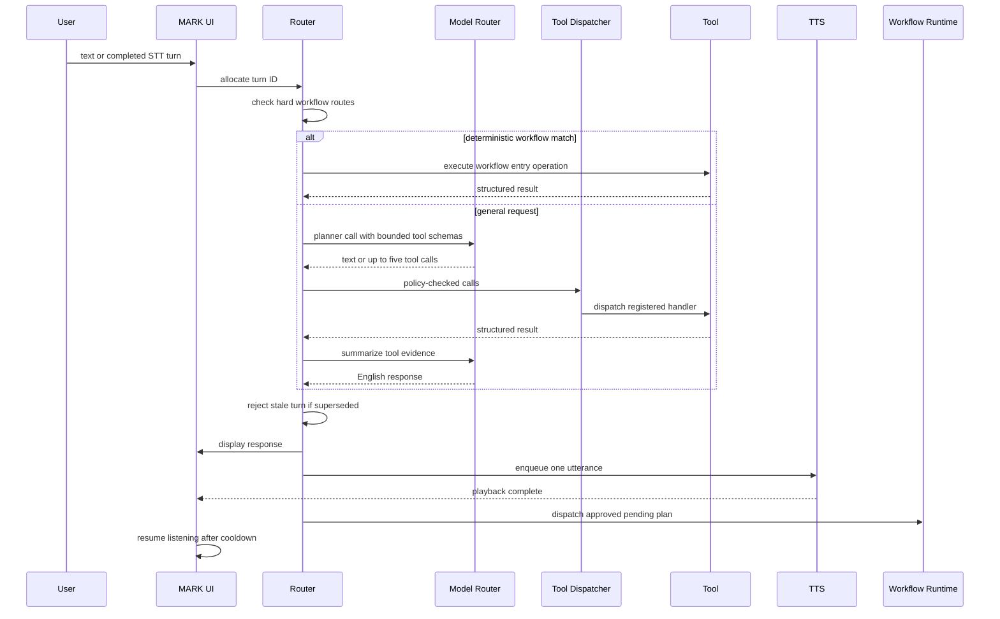

# Runtime Architecture and Turn Lifecycle

> [!abstract] Runtime model
> MARK XLVIII is a desktop Python application. Router mode is the normal local-first path: Gemini Live is optional, local STT/TTS remains available, and model/tool requests go through the same guarded router.

## Startup Sequence

1. The single-instance guard prevents a second desktop process from owning the UI and runtime resources.
2. `JarvisLive` loads non-secret runtime configuration and initializes UI callbacks, state locks, turn counters, queues, and workflow identifiers.
3. The dashboard is started when its optional dependencies are available.
4. Router mode warms the local TTS service asynchronously, places the UI in `LISTENING`, and starts the local microphone loop.
5. Background loops perform model cleanup and, only when explicitly enabled, scheduled task reviews.

> [!note] Optional Live mode
> Gemini Live has a separate realtime session path. It is not required for tools, local speech, plans, reports, memory, reminders, or LM Studio routing.

## One Conversational Turn

## Hard Workflow Routing

Before asking a model to choose a tool, `main.py` recognizes high-value request shapes that need deterministic ordering:

| Prompt family | Handler behavior |
| --- | --- |
| `create plan` | Runs plan research and writes a reviewable plan and run bundle |
| `revise plan` | Updates the latest or named plan and invalidates stale approval |
| `start plan` | Validates and approves the plan, queues execution after speech |
| `cancel planning` | Exits planning mode or requests cancellation for active work |
| `learn about this project` | Invokes read-only repository learning |
| `learn about <topic>` | Performs sourced topic learning and RAG persistence |
| blank to-do template | Creates the canonical Markdown template directly |
| current news plus report | Searches first, validates citations, then creates the report |

This layer prevents a small local model from replacing a multi-step operation with a plausible paragraph.

## General Tool Routing

For requests outside the hard routes:

1. The router builds a compact system prompt naming JARVIS, the current date/time, English-only behavior, and evidence boundaries.
2. Only schemas relevant to the prompt are supplied to `call_with_tools`.
3. A planner model may return prose or structured tool calls.
4. At most five returned calls are executed for the turn.
5. Tool results are truncated to a bounded summary payload and sent to a worker model for the final conversational answer.
6. Project-learning answers may use only returned takeaways and cited report content. A degraded inventory cannot be converted into an invented architecture summary.

## Turn IDs and Stale Reply Suppression

Every router submission receives a generation-aware turn ID. A new typed command, accepted voice turn, mute transition, or interruption can invalidate older work. Before display and speech, the response checks whether its turn is still current.

> [!important] Why this exists
> Local models and TTS can finish late. Without a turn ID, an older answer can arrive after a newer user request, speak over it, or dispatch an obsolete plan.

Stale turns are logged as suppressed and do not enter TTS. Interruption also drains queued audio and cancels pending or active plan runs where possible.

## Voice Turn Formation

The local Vosk path accumulates partial transcripts and audio activity until a turn boundary is reached. Current defaults include:

- English STT: `en-us`.
- End-of-turn silence: 2.5 seconds.
- Idle recognizer restart: 18 seconds.
- Post-TTS microphone cooldown: 3 seconds.
- Quiet-audio warning threshold: RMS 300.
- Filler check-in eligibility: 15 minutes since the last user input.

Noise-only transcripts such as isolated filler are filtered or cooldown-limited. Muting resets STT state; unmuting starts a fresh capture generation.

## Speech and Workflow Handoff

`start_plan` does not immediately run workers inside the conversational response. It stores the run ID as pending, tells the user that execution is queued, and calls TTS. Only after the response has been handed to speech does `_dispatch_pending_plan_after_turn` start a daemon workflow thread.

> [!important] Conversation isolation
> Worker progress is written to workflow state and artifacts. It is not injected continuously into the active conversation. The UI receives a completion, blocker, decision, or explicit status result.

## Background Responsibilities

| Loop | Behavior |
| --- | --- |
| Model cleanup | Every configured idle interval, unload non-baseline LM Studio models if no protected activity is active |
| Task review | Checks once per minute but performs scheduled review only when the user explicitly enabled a cadence |
| Vault watcher | Debounces Markdown changes and refreshes the local index |
| Dashboard relay | Routes dashboard text into Live mode or the same router-mode turn handler |

## Failure Behavior

- Tool or planner failure falls back to a worker text call when that fallback is safe.
- Empty model output becomes an explicit `model returned no text` message rather than a fabricated answer.
- Stale results are discarded.
- Failed TTS uses Windows SAPI while Orpheus warms or recovers.
- Failed plans produce blocker notes instead of reporting false completion.
- Unknown external side effects use `UNKNOWN_OUTCOME`; they are not silently retried.

## Related Notes

- [[02 Capability Registry MCP and Safety]]
- [[03 Planning Approval and Dual Orchestration]]
- [[07 Models Credentials Speech and Resource Lifecycle]]
