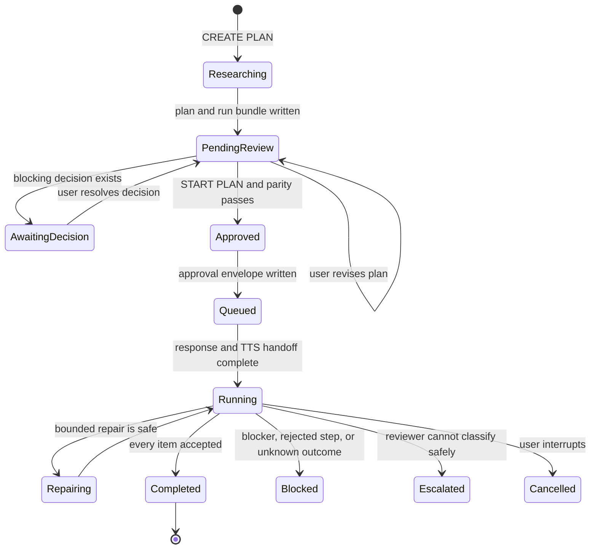

# Planning, Approval, and Dual Orchestration

> [!abstract] Dual orchestrator
> The cognitive orchestrator proposes plans, structured YAML, and review judgments. The deterministic orchestrator validates schemas, compiles dependency graphs, binds approval to immutable artifacts, dispatches registered actions, and commits results.

## Planning Lifecycle



## CREATE PLAN

`plan_workflow.create_plan` performs a read-only planning pass:

1. Interpret the requested objective and identify a registered project when possible.
2. Gather local context without changing project files.
3. Perform web research when the prompt requires current or external information.
4. Produce milestones, task ownership, decision points, constraints, acceptance criteria, and proposed artifacts.
5. Convert visible tasks into a strict `jarvis_dual_orchestrator/v1` YAML workflow.
6. Compile the YAML into an immutable JSON work manifest.
7. Write the plan and machine artifacts before asking for approval.

The user-facing plan is stored under `Jarvis_notes/Plans`. It is an Obsidian note with readable sections and an **Executable Work Items** table.

## Artifact Contract

For plan ID `P` and version `V`, the run bundle under `.jarvis/runs` contains:

| Artifact | Purpose |
| --- | --- |
| Plan Markdown | Authoritative intent, scope, decisions, permissions, and readable work-item rows |
| `workflow.yaml` | Frozen workflow definition and dependency graph |
| `work-items.json` | Compiled executable manifest with normalized steps and idempotency keys |
| `approval-projection.json` | Stable subset of plan fields that require renewed approval when changed |
| `run.json` | Plan path, run ID, version, and expected hashes |
| `approval.json` | Signed approval envelope created only after START PLAN |
| `results/*.json` | Atomic per-step results, verdicts, evidence, defects, and model provenance |

SQLite stores operational state in `.jarvis/workflows.sqlite`; it does not replace the approved artifact bundle.

## YAML Workflow Schema

The strict dialect is `jarvis_dual_orchestrator/v1`. A step declares:

- stable `step_id`;
- orchestrator and step type;
- registered target;
- `depends_on` edges;
- typed inputs and outputs;
- required outputs;
- negative constraints;
- risk tier and side-effect class;
- confirmation requirement;
- retry policy and maximum attempts;
- acceptance criteria;
- optional registered compensation hook;
- failure behavior.

Supported step types include tools, Python hooks, commands, model reasoning, gates, reviews, artifacts, memory commits, and fan-out aggregation.

> [!danger] No generated code execution
> The workflow cannot embed Python and cannot execute arbitrary shell text. Targets must already exist in a registered hook, command, or tool registry.

## Compilation and Dependency Checks

`compile_workflow` performs the following before a run exists:

1. Validate the schema and version.
2. Reject duplicate or missing step IDs.
3. Build a dependency graph and topologically sort it.
4. Reject cycles and unknown dependencies.
5. Verify every tool, hook, and command target.
6. Require confirmation metadata for registered commands that need it.
7. Restrict bindings to approved paths such as `result.<field>` and require the source step to be a dependency.
8. Assign resource classes and deterministic idempotency keys.
9. Run capability preflight.
10. Hash the workflow and manifest.

Legacy Aletheia-style YAML may be adapted for preview and diagnostics. It cannot execute until it conforms to the strict schema.

## Visible Parity and No Hidden Actions

The same work-item IDs must appear, in order, in:

1. the Markdown **Executable Work Items** table;
2. the YAML steps;
3. the JSON manifest.

START PLAN fails when parity differs. Workers may report follow-up work, but they cannot create and dispatch hidden child items. Scope expansion requires a visible plan revision and new approval.

## Decision Gates

Blocking design choices are machine-readable records containing:

```yaml
decision_id: decision-001
status: awaiting-user
question: What should be selected?
options: []
recommended_option: ""
impact: ""
blocks: []
user_response: ""
responded_at: ""
```

START PLAN remains disabled while any blocking decision is unresolved.

## Approval Binding

Approval is bound to:

- plan ID and plan version;
- approval-projection hash;
- workflow hash;
- manifest hash;
- complete approved action ID set;
- approval timestamp.

The envelope is signed using a local key protected with Windows DPAPI. Execution verifies the signature, artifact hashes, action set, and current run record before dispatch.

> [!warning] Approval drift
> Changing scope, permissions, decisions, executable steps, or arguments after approval produces `PAUSED_APPROVAL_DRIFT` or `PAUSED_HASH_DRIFT`. Readable progress fields are intentionally excluded from the approval projection.

## START PLAN

The Start Plan action:

1. resolves the selected or latest plan;
2. validates decisions, parity, hashes, and capability health;
3. creates the approval envelope;
4. marks the plan and execution summary as queued;
5. records the run ID for deferred dispatch;
6. returns a conversational confirmation;
7. starts workers only after the current speech turn is handed off.

The execution summary note lists packets, suggested workers, sequencing, evidence requirements, synthesis rules, and interruption behavior.

## Revision Behavior

A revision updates the plan version and visible content, then rebuilds YAML, JSON, projection, and hashes. Previous approval does not carry forward. Non-overlapping user edits should be preserved through reconciliation; overlapping edits create a visible conflict rather than silently choosing the agent version.

## Completion and Blockers

When every work item is accepted, `plan_workflow` creates a completion summary in `Summaries` and links it from the plan. Any blocked, rejected, escalated, cancelled, or uncertain run produces a blocker record with item states, attempts, options, and the decision needed from the user.

## Related Notes

- [[04 Fan-Out Workers Review and Recovery]]
- [[05 Research Reports and Repository Learning]]
- [[06 Obsidian Memory RAG Tasks and Canvas]]
