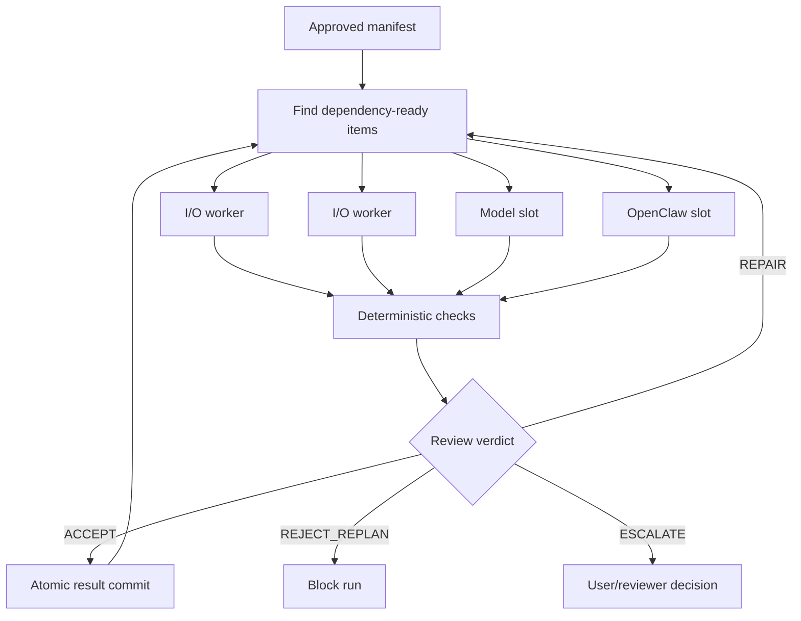

# Fan-Out, Workers, Review, and Recovery

> [!abstract] Bounded parallelism
> JARVIS can execute independent approved work items concurrently, but the worker pool is not allowed to multiply scarce model generations or invent new work. Parallelism follows the compiled dependency graph and runtime resource classes.

## Dependency-Ready Scheduling

The deterministic runtime creates a `ThreadPoolExecutor` with a default maximum of four workers. On each scheduling pass it:

1. reads current item states from SQLite;
2. finds `PENDING` or `REPAIR` items whose dependencies are all `ACCEPTED`;
3. submits ready items until the worker limit is reached;
4. waits for at least one item to finish;
5. stores accepted result records for downstream bindings;
6. repeats until all items are accepted or a terminal condition occurs.



## Resource Classes

| Class | Runtime capacity | Examples |
| --- | --- | --- |
| `io` | Up to the general worker limit | Search, file reads, deterministic hooks, note creation |
| `model` | One active slot | Model reasoning and independent model review |
| `openclaw` | One active slot | Approved coding scout or development task |
| `command` | General pool plus command policy | Registered executable and argument specification |

The one-slot model semaphore prevents the local research model from receiving two heavy generations at once. The one-slot OpenClaw semaphore prevents overlapping coding sessions from competing for the same project and resources.

> [!important] LM Studio `parallel=4`
> LM Studio's parallel value is an instance configuration, not four agents. JARVIS does not interpret it as permission to submit four complete TTS or research requests.

## Two Kinds of Fan-Out

### Scheduler fan-out

Independent predeclared steps run concurrently when their dependencies allow it. This is the primary form of real fan-out.

### YAML `fanout` step

The `fanout` step aggregates a list of **predeclared child results**. It counts children and failures and returns an aggregate status. It does not dynamically create executable children.

This preserves the visible-queue invariant: every executable child must already have a Markdown row, YAML step, and JSON item before approval.

## Worker Selection

Plan packets include a suggested worker based on task shape:

- deterministic local hook or tool for bounded operations;
- lightweight local model for extraction, formatting, and constrained summaries;
- strongest healthy research/reasoning model for synthesis or review;
- OpenClaw for approved coding scouts and development implementation;
- user or Claude boundary for final scientific interpretation where project policy requires it.

OpenClaw defaults to one agent. Two or three agents require explicit multi-file or parallel intent and remain subject to project gates. Every delegation creates a vault handoff record.

## Result Bindings

Downstream inputs can bind to approved fields from dependency results. Bindings are restricted to paths such as:

```yaml
input:
  bind:
    from_step: gather_sources
    path: result.sources
```

The compiler rejects bindings to non-dependencies or arbitrary object paths. Runtime resolution occurs immediately before dispatch.

## Acceptance and Review

Every result passes deterministic acceptance checks before optional model review. Checks can require:

- `ok: true`;
- required output fields;
- artifact paths that exist;
- source or citation counts;
- test return codes;
- schema-conforming structured output;
- negative constraints and scope boundaries.

Review verdicts are:

| Verdict | Meaning |
| --- | --- |
| `ACCEPT` | Hard criteria pass and no material defect remains |
| `REPAIR` | Defect is bounded, localizable, retry-safe, and within the attempt budget |
| `REJECT_REPLAN` | Critical defect, scope breach, unsupported conclusion, exhausted attempts, or unsafe output |
| `ESCALATE` | Reviewer confidence is insufficient for a safe classification |

High-risk or model-generated work can require an independent reviewer context. The reviewer receives the original evidence and acceptance criteria rather than only a worker summary. Model provenance is stored with the result.

## Retry and Repair

The compiler caps attempts at three. A repair is allowed only when the step is marked retry-safe. Reaching the attempt limit converts another repair request into `REJECT_REPLAN`.

Percentage error estimates may be retained as telemetry, but they do not authorize execution.

## Leases and Checkpoints

When a worker claims an item, SQLite records:

- worker and lease owner;
- lease expiration and heartbeat;
- attempt and repair count;
- idempotency key;
- retry-safe classification;
- side-effect class;
- result path and error state.

Checkpoints include preparation, before dispatch, side-effect start, result write, commit, interruption, lease recovery, and compensation outcome. A heartbeat thread extends the active lease while work proceeds.

## Idempotency

Each item receives an idempotency key derived from the workflow ID, version, and normalized step. Accepted result paths are recorded separately. A restarted run reuses an existing committed result instead of repeating the action.

## Crash Recovery

Expired `RUNNING` items are handled by side-effect safety:

- Retry-safe item: reclaim into `REPAIR`.
- Non-retry-safe item: mark `UNKNOWN_OUTCOME` and stop.
- Unexpired lease: return `RUN_ALREADY_ACTIVE` rather than launching a duplicate.
- Missing or changed manifest item: pause for item drift.

`UNKNOWN_OUTCOME` is intentionally conservative because an external action may have succeeded before the process died.

## Cancellation

User interruption sets a run cancellation event, marks the run `PAUSING`, and cancels pending or repairable items. Active hooks and commands receive cancellation signals where supported. Model results completed after cancellation are discarded.

Cancellation cannot guarantee reversal of an external side effect already committed. Such cases require checkpoint review.

## Compensation

A side-effecting step may name a registered compensation hook. On rejection, unknown outcome, or terminal failure, the runtime invokes that hook with the original inputs, partial result, and error. Compensation success or failure is checkpointed and logged.

## Run Finalization

| Item condition | Run state |
| --- | --- |
| All items `ACCEPTED` | `COMPLETED` |
| Any `ESCALATE` | `ESCALATED` |
| Any `UNKNOWN_OUTCOME`, `REJECT_REPLAN`, or `BLOCKED` | `BLOCKED` |
| Remaining repairable item | `REPAIRING` |
| Cancellation requested | `CANCELLED` |

## Related Notes

- [[03 Planning Approval and Dual Orchestration]]
- [[07 Models Credentials Speech and Resource Lifecycle]]
- [[09 Implementation Log and Known Boundaries]]
