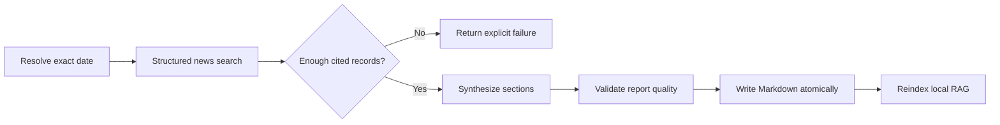

# Research, Reports, and Repository Learning

> [!abstract] Evidence-first output
> Research workflows separate source gathering, synthesis, validation, persistence, and memory extraction. A report must retain citations and provenance; a conversational summary is not treated as a completed research artifact.

## Structured Web Search

`actions/web_search.py` normalizes search and news results into records containing:

- `title`;
- `snippet`;
- `url`;
- `source`;
- `published_at`;
- `retrieved_at`;
- `backend`.

The search layer can use configured APIs, DuckDuckGo clients or HTML, Bing HTML, Google News RSS, and specialized GitHub repository search. Results are normalized and deduplicated before report generation.

### Current and news requests

For words such as `today`, `latest`, or `current`, the runtime resolves the exact local date and adds a date scope to both the query and report metadata. If today's results are insufficient, a 24-48 hour fallback must be labeled rather than presented as same-day coverage.

When `require_citations=true`, an empty or uncited result set fails clearly. The report writer must not replace missing sources with generic model knowledge.

## Current News Report Workflow

`jarvis_memory.create_report_from_search` validates the source payload, creates section-aware Markdown, writes provenance into frontmatter and body, and reindexes the note.

## Report Quality Contract

A cited report normally requires:

- non-empty executive summary;
- non-empty findings;
- evidence and source sections;
- minimum cited source count;
- original query and search mode;
- exact date range where applicable;
- retrieval timestamp;
- source count and workflow ID;
- no placeholder source labels;
- no invented URLs or unsupported claims.

If model synthesis is unavailable, deterministic sections can still be built from structured source records. The degraded state must remain visible.

## Deep Research

Deep research selects the research model route and can be embedded in a plan with multiple source-gathering items, a synthesis item, independent review, and final report creation. Smaller workers may gather or normalize bounded evidence; the strongest healthy model performs the synthesis when the workflow quality floor permits it.

> [!note] Current consolidation behavior
> A single direct deep-research request normally produces one report. A planned multi-branch research run can preserve genuinely contrasting themes as separate reports and then create a consolidated synthesis. It does not split reports merely to simulate agent activity.

## Learning a Topic

`jarvis_memory.learn_topic` combines research persistence with memory extraction:

1. Validate and normalize cited research records.
2. Create a long-form note under `Deep Research`.
3. Extract concise accepted key points.
4. Create a learned-topic memory note under `Memories/learned_topics`.
5. Link the memory back to the full report and sources.
6. Reindex the vault.

Only compact takeaways enter the frequently retrieved memory layer. Full evidence remains in the report.

## Read-Only Repository Learning

The repository-learning workflow is triggered by prompts such as `learn about this project` or `read and understand this directory`.

### Inventory

The scout resolves the root, uses Git-tracked files when available, otherwise walks the directory, and excludes generated/cache directories, the vault, and sensitive file patterns. It records:

- canonical root;
- snapshot hash;
- file and byte counts;
- suffix distribution;
- skipped sensitive count;
- Git branch, commit, and status where available.

Default safeguards cap the inventory at 5,000 files.

### Representative reading set

Files are scored by category and spread across top-level folders. README files, manifests, entry points, configuration, workflows, tests, and important source files receive priority. Defaults read up to 36 files, 800,000 total bytes, and 120,000 bytes per file; configurable hard caps prevent an accidental whole-repository prompt.

Explicit deny-list before any scoring happens: `.env`/`api_keys.json`/`credentials.json`/`id_rsa`/`known_hosts`-style names, `.key`/`.pem`/`.pfx`/`.p12`/`.kdbx`/`.sqlite`/`.db` suffixes, and secret/credential/api-key-shaped filenames are excluded from the inventory outright, independent of `.gitignore` state — see [[14 Graphify Knowledge Graph Integration]] for how this compares to the external tool's own (weaker, extension-allowlist-based) protection.

> [!success] Graphify-informed centrality (2026-07-25)
> When a pre-built graphify knowledge graph exists for the project (`graphify-out/graph.json`), file scores also fold in real cross-file relationship degree — `calls`/`inherits`/`references` edges, not just the import-only dependency graph this pipeline already reconstructs from scratch every run. Strictly additive: a project with no graph gets byte-identical selection to before this existed. See [[14 Graphify Knowledge Graph Integration]] for the full mechanism and a real production bug this surfaced and fixed.

### Mapping and synthesis

Selected files are segmented into bounded source batches. Coverage rotates across files before returning to later segments of a single large file. Each block carries a canonical `[file:path]` citation and is wrapped as untrusted source text.

A Python file's own content is presented as structured, deduplicated code slices (`core/repo_slicer.py`) rather than raw text — one slice per function/method/class, with real signatures, call graphs, docstrings, and complexity, ranked so the most informative units survive a truncated character budget. When a graphify graph exists, that ranking also weighs real cross-file usage first (`_graphify_symbol_degree`): a function with genuine callers elsewhere in the codebase outranks a merely-complex, unused one. Omitting the graphify signal reproduces the original complexity-only ranking exactly.

The synthesis must contain:

- Executive Summary;
- Repository Profile;
- Architecture and Components;
- Entry Points and Workflows;
- Dependencies and Tests;
- Operational Guidance;
- Risks, Gaps, and Questions;
- RAG Takeaways;
- Files Read.

Quality checks reject unknown file citations, uncited architecture sections, claims contradicted by inventory, and visibly incomplete takeaways. If only the RAG Takeaways section is missing, the service may repair it using complete cited statements already present elsewhere in the report. It does not invent new takeaways.

### Outputs

| Artifact | Contents |
| --- | --- |
| `Projects/<project>/Project Brief.md` | Human-readable, cited repository understanding |
| `Projects/<project>/Project Memory.md` | Compact accepted takeaways and pointer to the brief |
| `.jarvis/project_learning/<project>.json` | Snapshot, files read/mapped, diagnostics, and cache metadata |

An unchanged, previously verified snapshot can reuse its cached report. A changed snapshot requires a new learning pass.

## Large Document and Folder Analysis

`actions/document_workflow.py` provides resumable extraction and chunk/map/reduce processing.

Supported extraction includes text/code/data files, PDF text with optional English OCR, DOCX paragraphs and tables, PPTX slide text, image OCR, ZIP inventory, and media metadata via `ffprobe`.

The pipeline:

1. fingerprints the source and instruction;
2. inventories a folder with file/byte caps;
3. extracts source-located segments;
4. creates overlapping chunks with stable IDs and citations;
5. maps each chunk into findings, evidence, uncertainty, and questions;
6. checkpoints every mapped chunk under `.jarvis/file_jobs`;
7. hierarchically reduces large map output while retaining citations;
8. writes a structured final report and reindexes it.

> [!important] Resume behavior
> A repeated job with the same source fingerprint and instruction reuses completed map chunks. Changed source timestamps, sizes, paths, or instructions create a different fingerprint.

Current chunk mapping is resumable and sequential inside one document job. Parallel document branches should be represented as separate approved workflow items so model-generation resource limits remain enforceable.

## Prompt Injection Boundary

Every repository file, web page, and document chunk is marked as untrusted evidence. Instructions found in source text must be summarized as content, never obeyed as runtime instructions.

## Related Notes

- [[03 Planning Approval and Dual Orchestration]]
- [[04 Fan-Out Workers Review and Recovery]]
- [[06 Obsidian Memory RAG Tasks and Canvas]]
- [[14 Graphify Knowledge Graph Integration]]
