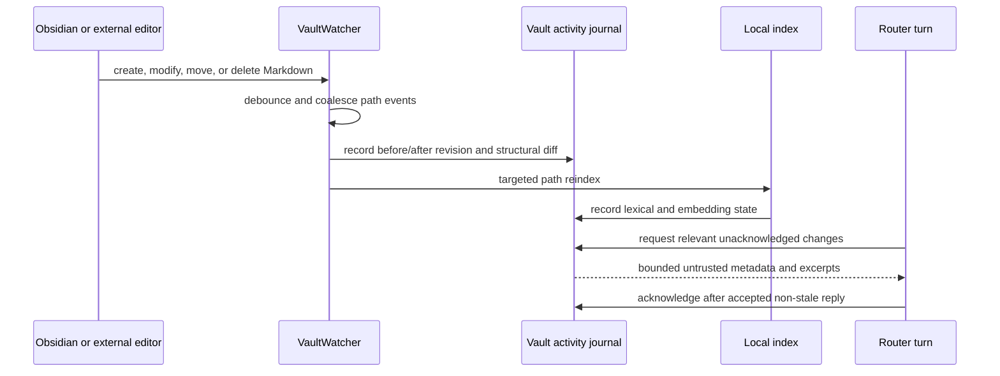

# Vault Change Awareness

> [!summary]
> External Markdown edits are journalled, structurally summarized, indexed, and supplied once to the next relevant JARVIS turn. Whole notes are never placed into every prompt.

## Ownership Boundary

| Component | Responsibility |
| --- | --- |
| `actions/vault_watch.py` | Watch recursive Markdown and Canvas paths, debounce bursts, and serialize index work |
| `core/vault_activity.py` | Persist revisions, write receipts, structural diffs, and turn acknowledgements |
| `actions/jarvis_memory.py` | Atomically write notes and target changed paths in the local index |
| `main.py` | Snapshot relevant events at the router turn boundary and acknowledge accepted context |
| `.jarvis/memory.sqlite` | Store derived revisions, journal events, acknowledgements, RAG, and Canvas relationships |

## Event Lifecycle



## SQLite v5 Tables

| Table | Purpose |
| --- | --- |
| `vault_file_revisions` | Last observed hash, note ID, structure, sensitivity, and deletion state |
| `vault_write_receipts` | Expected content hashes registered before JARVIS atomic writes |
| `vault_change_events` | Coalesced external changes with bounded summaries and index state |
| `vault_change_acknowledgements` | Consumer and turn that incorporated each event |

> [!important] First-launch behavior
> The v5 upgrade creates a silent baseline. Existing notes are not reported as newly edited merely because the journal was introduced.

## Self-Write Deduplication

Before replacing a Markdown or Canvas file, `jarvis_memory.atomic_write()` records the exact UTF-8 byte hash and an expiring writer receipt. The watcher still indexes the resulting event, but a matching receipt marks it `jarvis` and excludes it from user-change notifications. Windows newline conversion is avoided by writing the registered bytes directly.

Unmatched or expired receipts are classified as external/unknown. This is intentionally conservative: a user edit must not be hidden merely because its path resembles a JARVIS write.

## Bounded Turn Context

`turn_change_context()` ranks pending events against the current request. Broad requests such as “what changed in the vault?” can include the newest changes; specific requests prefer matching titles, paths, IDs, and terms.

Defaults:

- Maximum events: `8`
- Maximum context: `1,800` characters
- Protected sensitivity values: `private`, `confidential`, `secret`, `credential`, `restricted`
- Consumer: `desktop-router`

The context is appended to the user-evidence boundary with an explicit no-authority label. It is not inserted into the policy/system prompt. Protected notes expose metadata but no body excerpts.

> [!warning] Active turns
> The router snapshots changes at turn start. Edits arriving while a turn is running remain unacknowledged and are available to a later relevant turn.

## Recovery And Reconciliation

- Startup compares revision rows with current Markdown paths.
- Move correlation uses stable note IDs or unique content hashes.
- Deletions remain represented through revision/tombstone state.
- Periodic full scans reconcile missed filesystem events.
- Lexical and embedding freshness are reported separately; an embedding delay is never described as current.
- SQLite connections use WAL, bounded busy timeouts, and explicit close semantics on Windows.

## Configuration

```json
{
  "rag_watch_enabled": true,
  "rag_watch_debounce_seconds": 2.0,
  "vault_turn_awareness_enabled": true,
  "vault_turn_change_limit": 8,
  "vault_turn_change_max_chars": 1800
}
```

## Validation

```powershell
python -m pytest tests/test_vault_activity.py tests/test_vault_watch.py tests/test_router_mode.py -q
```

Coverage includes first-run baseline, rapid saves, self-write receipts, protected notes, move/delete identity, targeted reindexing, relevant context injection, stale-turn suppression, and post-reply acknowledgement.

## Related Notes

- [[06 Obsidian Memory RAG Tasks and Canvas]]
- [[11 Safe Canvas Service and Relationships]]
- [[12 Process Trace and Operational UI]]
- [[08 Storage Configuration and Operations]]
