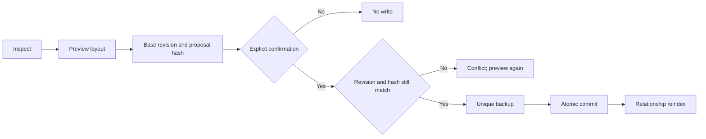

# Safe Canvas Service And Relationships

> [!summary]
> Models request semantic Canvas operations. Structural parsing, revision checks, backups, placement, and relationship indexing remain deterministic.

## Modules

| Module | Role |
| --- | --- |
| `core/canvas_document.py` | Parse, validate, preserve unknown fields, calculate revisions/proposal hashes, merge generated and manual content |
| `core/canvas_layout.py` | Rectangle-aware deterministic profiles, pin detection, overlap/crossing metrics, incremental placement |
| `core/canvas_index.py` | Derived Canvas files/nodes/edges/reference tables and cross-Canvas queries |
| `actions/jarvis_canvas.py` | Guarded action facade, plan/task sync, task proposals, semantic mutations |

## Structural Contract

JSON Canvas 1.0 permits omitted `nodes` and `edges`; therefore `{}` is a valid empty document. The service adds empty arrays in memory without inventing fields on disk until an approved write occurs.

Validation reports:

- malformed JSON;
- duplicate or missing node/edge IDs;
- dangling edge references;
- invalid sides;
- non-finite or non-integer geometry;
- non-positive dimensions;
- missing native node content.

Unknown top-level and node fields round-trip unchanged. Unknown node types are preserved and pinned with a warning. A malformed source is never replaced by an empty Canvas.

## Safe Layout Flow



`preview_layout` returns geometry before/after, profile, managed/pinned counts, cycle diagnostics, `base_revision`, and `proposal_hash`. `commit_layout` deterministically recomputes the proposal and refuses drift.

## Layout Profiles

| Profile | Behavior |
| --- | --- |
| `plan` | Left-to-right source, plan, action, review, blocked, and complete lanes; bounded grids inside busy lanes |
| `tasks` | Source/status lanes plus bounded multi-column action/completion grids |
| `dependency` | Top-to-bottom topological layers and visible cycle diagnostics |
| `evidence` | Dependency layout for evidence lineage |
| `relationship` | Stable clustered grid for note/project maps |

Node rectangles include width, height, and separation margins. New nodes are scored near an anchor and moved until they do not overlap. Default repeated labels such as `next`, `contains`, and `source` are suppressed during an explicit layout preview.

## Manual Position Policy

- IDs outside the JARVIS managed prefix are pinned.
- Unknown node types are pinned.
- Explicit `jarvis.pinned` nodes are pinned.
- A committed layout stores a geometry baseline.
- If a user moves a managed node afterward, its current geometry differs from that baseline and the next preview treats it as pinned.

Plan/task sync preserves manual nodes, unknown top-level extensions, and existing geometry. It removes only stale generated content within the managed ownership boundary.

## Cross-Canvas Index

Derived tables in `.jarvis/memory.sqlite`:

- `canvas_files`
- `canvas_nodes`
- `canvas_edges`
- `canvas_references`

References are extracted from file nodes and JARVIS task/project metadata. `relationships` can show which canvases share a note, task, or project, and exposes stale/superseded metadata when present. Canvas watcher events update this index without forcing Markdown RAG to rescan every note.

> [!important] Authority
> Canvas remains a view. Supported task checkbox or permission edits become visible, hash-checked proposals. Only a confirmed proposal updates canonical Markdown.

## Semantic Operations

`status`, `inspect`, `validate`, `preview_layout`, `commit_layout`, `sync_plan`, `sync_tasks`, `neighbors`, `add_node`, `update_node`, `remove_node`, `add_edge`, `remove_edge`, `relationships`, `reindex`, `reconcile`, `task_changes`, and `apply_task_changes`.

## Validation Artifacts

Read-only before/preview renders are stored under:

`Mark-XLVIII-main/test_artifacts/vault-canvas-ui/canvas/`

The renderer reads representative live Canvases but never commits its preview.

```powershell
python -m pytest tests/test_jarvis_canvas.py -q
python scripts/render_validation_artifacts.py
```

## Related Notes

- [[10 Vault Change Awareness]]
- [[06 Obsidian Memory RAG Tasks and Canvas]]
- [[12 Process Trace and Operational UI]]
