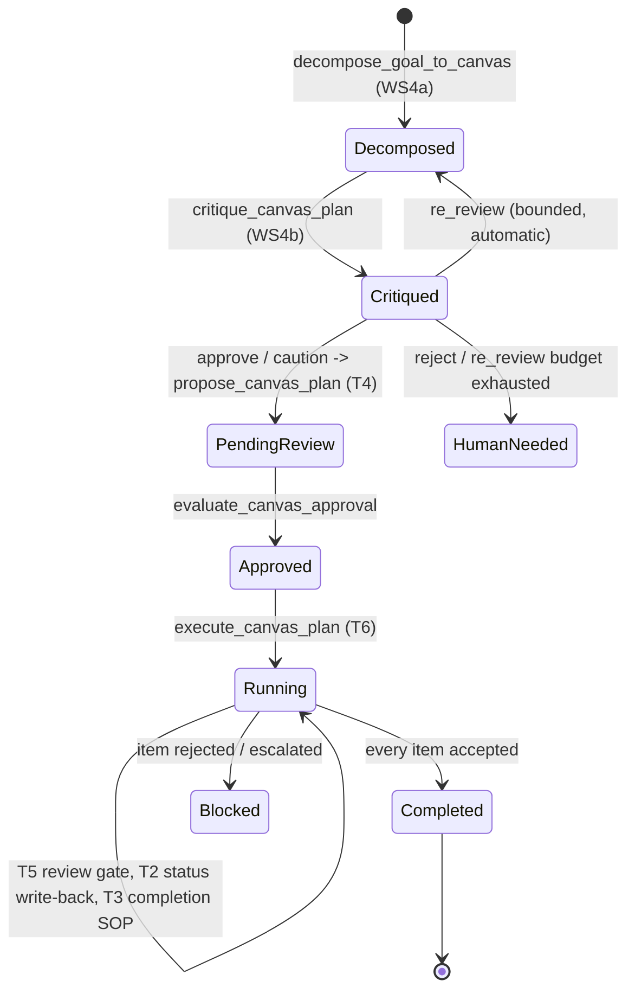

# Canvas Planning Engine and Reasoning-Backed Decomposition

> [!abstract] Mode 2 planning
> [[03 Planning Approval and Dual Orchestration|Note 03]] documents Mode 1: `plan_workflow.create_plan` turns a prompt into Markdown + YAML + JSON via a fixed keyword router, with no model reasoning about task shape. **Mode 2** is a parallel, model-reasoned path: a goal (or a hand-drawn `.canvas` graph) becomes a real Obsidian Canvas of dual-purpose nodes, gets critiqued and automatically refined, and only then compiles onto the *same* `jarvis_dual_orchestrator/v1` schema, approval envelope, and `WorkflowRuntime` that Mode 1 already uses. All of Mode 2 lives in `actions/canvas_plan.py` (2400+ lines) and `core/canvas_layout.py`. [[11 Safe Canvas Service and Relationships|Note 11]] covers the structural Canvas service (`canvas_document.py`/`canvas_index.py`) this builds on; it does not cover planning logic.

## Lifecycle



A hand-drawn `.canvas` can enter at `Critiqued` or `PendingReview` directly — decomposition is optional, not a gate. Every stage after decomposition treats a model-generated canvas and a hand-drawn one identically; nothing downstream knows which one produced the file.

## D1: every node is dual-purpose

A canvas node is simultaneously a compiled workflow step and a complete, self-contained prompt for whichever agent executes it. Leading `key: value` lines are directives; the first non-directive line starts the prose the executing agent actually reads (`_parse_node_directives`, `canvas_plan.py`):

```
role: implementation
branch: A
project: mark_platform
scope: tests/test_foo.py
file: actions/foo.py
recommended model: developer (openclaw)

Build the thing. This line and below is the agent's actual instruction.
```

| Directive | Applies to | Compiles into |
| --- | --- | --- |
| `role:` / `type:` | all | step type via `_ROLE_SPECS` (below) |
| `scope:` / `test:` | verification | `inputs.args` |
| `project:` | implementation (**required**) | `inputs.project_id` (a `plan`-role node's own `project:` sets the canvas-wide default; a node-level value overrides it) |
| `file:` | reference / implementation | `inputs.file` |
| `recommended model:` | any | `inputs.recommended_model` — a visible, editable hint (D2), inert on dispatch |
| `branch:` / `task:` | any (WS4c) | fan-out column grouping — see below |
| `mode:` | the `plan`/`workflow`-anchor node only | `workflow["variables"]["mode"]` — purely descriptive `research`/`development` routing metadata, never validated or enforced |

> [!danger] An implementation node with no project target is a compile-time blocker (2026-07-30)
> This used to compile happily and then do nothing. Nothing set `project_id`, and `project_operator` reads a missing one as `operation=list` — returning the registered project list with `ok: true`. So an **approved** implementation node reported success having delegated no work at all. The node's prose was not forwarded either; that half (`intent`) was fixed by WS4d.
>
> `compile_canvas` now refuses, naming the node and listing the registered project ids so the gap is fixable in Obsidian. It blocks rather than defaulting: choosing a project automatically would silently authorise OpenClaw against a live repository the moment a human approves, which is a far larger blast radius than a loud failure. Failing at compile time means it surfaces in the preview and plan note *before* any approval exists.
>
> `decompose_goal_to_canvas` pins its `project_hint` onto the plan anchor for this reason — leaving the directive to model discretion would make generated plans fail to compile whenever the model declined to repeat it. The decomposition schema now states `project` is required on implementation nodes.

> [!important] D2 — targeting is a visible recommendation, not a silent default
> `recommended model:` is rendered on the node and in the T4 approval preview. Left unedited, it counts as accepted; edited, the plan fingerprint changes and re-triggers approval. Nothing about targeting is a silent default a human never sees.

## Terminology (2026-07-25): workflow → goal → task → subtask

The owner's vocabulary pass gives distinct names to concepts this engine already had, mostly without changing any mechanics:

- **workflow** — the canvas's own single anchor node. `role: workflow` is now the preferred spelling; `root`/`goal`/`milestone`/`plan` all still resolve to the exact same internal `"plan"` role and behaviour (`_ROLE_ALIASES`) — this is a vocabulary addition, not a rename, so no existing hand-drawn canvas needs to change.
- **goal** — a workflow's own stated objective. For now this is 1:1 with the workflow itself (most workflows have exactly one goal); genuine multi-goal decomposition within one workflow is a real but not-yet-built extension, deliberately deferred rather than half-built into the schema.
- **task** — a macro pillar, i.e. a WS4c `branch:`. `task:` is now an accepted alias for `branch:` in a node's directive lines (`_DIRECTIVE_ALIASES`) — same fan-out column grouping, same layout behaviour, just the intended word.
- **subtask** — an individual node stacked within a task/branch's own column.

`user_workflow.mode` (`research` | `development`) is optional and purely descriptive: set it via `decompose_goal_to_canvas`'s new `user_workflow_mode` parameter (written as a `mode:` directive onto the generated anchor node) or by hand-typing `mode: development` on a hand-drawn canvas's own anchor node. Nothing currently reads or enforces it — it exists so a future routing decision has somewhere real to look, not to gate anything today.

## Role → step compilation

`_ROLE_SPECS` maps each role to a step template; an absent or unrecognised role resolves to the least-privileged `research` default — a canvas can never silently mint a side-effecting step.

| Role | step_type | Side effects | Notes |
| --- | --- | --- | --- |
| `plan` (write `role: workflow`) | gate | none | anchors the graph; exactly one required |
| `research` | model_reasoning | none | |
| `note` | *(excluded)* | none | WS4c pass-forward fact; never dispatched — `compile_canvas` resolves any `depends_on` through it to the real upstream step |
| `review` | review | none | T5 dual critic (below) |
| `reference` | gate | local_read | |
| `verification` | command | local_read | runs `pytest_focused`; `requires_confirmation: false` |
| `implementation` | tool | external_write | `project_operator` → `delegate_openclaw`; `requires_confirmation: true` |

## WS1 — anti-fabrication in the approval preview

The T4 approval table's "Resolved target" column shows what will *actually* run, not the node's prose — `⚠ no project target` / `⚠ no scope — runs the entire suite` when a directive that side-effecting role needs is missing, rather than describing an action the compiled step can't take.

## WS4a — `decompose_goal_to_canvas(goal, ...)`

Calls `call_text(role="planner")` (cloud-tiers-to-local per D3, [[07 Models Credentials Speech and Resource Lifecycle|Note 07]]) with a schema prompt, validates the response (`_validate_decomposition`: exactly one `plan` node, no orphans, valid `branch`/`deliverables` format), lays it out (`core.canvas_layout.layout_document`), and writes a real `.canvas` file. Non-authoritative and read-only beyond that file — nothing downstream is proposed, approved, or executed automatically.

Takes an optional `max_attempts` (default 3): on a parse or validation failure, the specific problems are fed back into the next attempt's prompt rather than surfacing a one-shot failure — live testing found the local overseer succeeding on multi-branch goals roughly 2 times in 6 without this. A dependency cycle is a one-shot failure, deliberately not retried (a different failure class).

## WS4b — critique pass and the weighted refine loop (D5)

`critique_canvas_plan(canvas_path, ...)` extends T5's per-node dual-critic pattern to whole-plan level: a second planner-role call judges the decomposition itself (`approve` / `caution` / `re_review` / `reject`), backed by a deterministic post-check (`_plan_role_ordering_violations`) that force-escalates a verification node wired before its own implementation — live testing showed the model itself approving that ordering bug, twice.

`critique_and_propose_plan(goal, ...)` is the D5 loop:

- `re_review` rewrites the plan with the critique's own findings folded in and re-critiques, bounded by `max_rewrites`, fully automatic.
- `caution` / `reject` are the only paths that pull a human in. `caution` still proposes through the normal T4 gate with a `[!warning]` callout prepended to the approval note; `reject` (or an unresolved `re_review` after the rewrite budget runs out) does not call `propose_canvas_plan` at all.
- Critique is a linked Obsidian note (`Plans/canvas-critique-<id>-r<n>.md`), always wikilinked from the resulting approval note — Obsidian's own linking is the substrate (D5), not a JARVIS-UI panel.

## WS4c — branch-aware fan-out

`branch:` groups nodes into columns for a goal with 2+ largely-independent macro components. Layout (`core/canvas_layout.py`, `"dependency"` profile): each branch's own root (its most-synthesized node) sits at the top of its column, deeper prerequisites stack downward — the opposite of normal top-to-bottom reading, because decomposition reads outward on both axes while execution flows back toward the goal. **A node's own explicit `branch:` tag always wins its column placement, regardless of what feeds it** — a node with no tag of its own is the only kind eligible for the fan-out's other rule, sitting at the x-midpoint between whichever tagged branches feed it (a genuine shared/wrap-up node, e.g. a final integration step depending on two branches' output).

Zero or one distinct `branch` value is a strict backward-compatible fallback to the original single-chain layout, pinned by dedicated regression tests.

## WS4d — context inheritance and deliverables

Only `review` steps ever got automatic context from a dependency (T1's `evidence` binding, `result.summary`). Every other node ran on self-authored prose alone. `_context_preamble()` assembles a deterministic, ~220-char-per-fragment-capped block from prose already on the canvas — the plan's goal, the node's own branch purpose, one line per sibling branch — injected into `inputs.prompt` (research/review) or prepended onto `inputs.intent` (implementation), the exact fields dispatch already reads. No new model call.

Evidence-binding extends beyond review, but only to dependencies whose own role produces a reliably `summary`-shaped result (`research`/`note`/`review`/`plan`/`reference`) — `command`/`tool` results have no common `summary` field, so binding one would silently resolve to `None`.

Optional `deliverables` per node compiles into real, node-specific `step["acceptance_criteria"]["deliverables"]`, replacing the previously universal, unfalsifiable `{"required": true}`.

> [!success] Live-measured, not just structurally present
> Two focused before/after comparisons (same node, same model, bare prose vs. the real compiled preamble) found a genuine architectural-consistency failure without context: a frontend node with no visibility into a sibling backend branch's stated constraint ("the frontend never sees the OAuth token directly") recommended storing the token client-side. With the sibling-branch line present, the same node correctly honored the constraint throughout. See [[2026-07-25-ws4d-execution-quality-evaluation]].

## WS3 — cloud tiering

`role="planner"` (WS4a/b's decomposition and critique calls) resolves cloud-first, large-local-fallback: `resolve_settings` tries the configured cloud provider (OpenAI or Anthropic, whichever key is linked via the session key box) and falls back to LM Studio automatically on any failure or missing key — never a hard failure. `core/model_router.py` treats `anthropic`/`claude` and `openai` as first-class, parallel providers.

## Known boundaries

- Multi-branch decomposition succeeds roughly 2 times in 6 live attempts even with the retry wrapper's help on some goals — validation always refuses a malformed attempt cleanly (nothing bad is ever written), but this is real, measured model-reliability variance, not eliminated.
- Evidence-binding does not cover `verification`/`implementation` dependencies (command/tool results have no common `summary` field) — would need normalizing `dual_orchestrator.py`'s shared result-construction code, deliberately not done given its blast radius across Mode 1 workflows too.
- The WS4d execution-quality finding is two illustrative comparisons, not a statistically controlled study.
- VRAM-aware model admission (a byte-budget alternative to the flat `max_task_models_loaded` count) remains unbuilt — see [[07 Models Credentials Speech and Resource Lifecycle|Note 07]].

## Related Notes

- [[03 Planning Approval and Dual Orchestration]] — the Mode 1 system this compiles onto
- [[11 Safe Canvas Service and Relationships]] — the structural Canvas layer underneath
- [[04 Fan-Out Workers Review and Recovery]] — T5/T6's shared execution machinery
- [[Planning Subsystem Roadmap]] — the design log (D1-D5) and workstream build history
